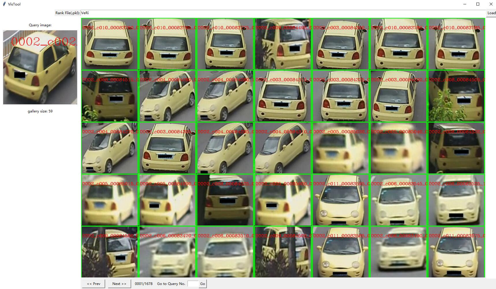

# open-VehicleReID 

## Introduction 

This is a repository for vehicle Re-ID.

## Installation

### Requirements
* Linux
* CUDA 8.0 or higher 
* Python3
* Pytorch 1.1+

### Install open-VehicleReID
1. Clone the open-VehicleReID repository.
```shell
    git clone https://github.com/BravoLu/open-VehicleReID.git
```

2. Install the dependencies. 
```shell
    cd open-VehicleReID 
    pip -r install requirements.txt 
```

## Get Started

1. Download the dataset ([VeRi776](https://vehiclereid.github.io/VeRi/)\\[VehicleID](https://www.pkuml.org/resources/pku-vehicleid.html)\\[VeRi_Wild](https://github.com/PKU-IMRE/VERI-Wild)).

2. Train
```shell
    python main.py -c {$CONFIG_FILE} \\
                   -d {$DATA_PATH} \\
                   --gpu {$GPU_IDS} \\
                   --log {$LOG_DIR} \\
                   --save {$CKPT_SAVE_PATH} \\
                   --seed {$SEED} 
    (e.g.)
    python main.py -c configs/baseline.yml -d /home/share/zhihui/VeRi/ --log logs/veri/baseline --save ckpts/veri/baseline --gpu 0,1 --seed 0 
```

3. Test 
```shell 
    python main.py -c {$CONFIG_FILE} \\
                   -d {$DATA_PATH} \\
                   --ckpt {$CKPT_PATH} \\
                   --gpu {$GPU_IDS} \\
                   --seed {$SEED} \\
                   -t 
    (e.g.)
    python main.py -c configs/baseline.yml -d /home/share/zhihui/VeRi/ --ckpt ckpts/baseline/checkpoint.pth --gpu 0,1 --seed 0
```
## Visualization 

* We visualize the ranking list in Windows 10.

1. Generate the ranking list pickle file.
```shell
    python main.py -c {$CONFIG_FILE} \\
                   -d {$DATA_PATH}  \\
                   --ckpt {$CKPT_PATH} \\
                   --gpu {$GPU_IDS} \\
                   --seed {$SEED} \\
                   --vis {$OUTPUT_PKL_PATH} \\ 
                   -t
```

2. Visualize the ranking list according to the .pkl file generated in step 1. 
```shell
    cd visualization
    python visualization.py --data ${DATA_ROOT}
```


Input the file name (without extension) on the entry of Rank File(.pkl).



* (Green denotes same ids, red denotes different ids.)

## Benchmark
* VehicleID

<table>
   <tr>
      <td rowspan="2">Model</td>
      <td rowspan="2">scale</td>
      <td colspan="3" align="center">Small</td>
      <td colspan="3" align="center">Median</td>
      <td colspan="3" align="center">Large</td>
   </tr>
   <tr>
      <td>Rank 1</td>
      <td>Rank 5</td>
      <td>Rank 10</td>
      <td>Rank 1</td>
      <td>Rank 5</td>
      <td>Rank 10</td>
      <td>Rank 1</td>
      <td>Rank 5</td>
      <td>Rank 10</td>
   </tr>
   <tr>
      <td>Basline</td>
      <td>224x224</td>
      <td>76.4%</td>
      <td>89.2%</td>
      <td>92.9%</td>
      <td>74.5%</td>
      <td>86.5%</td>
      <td>90.2%</td>
      <td>71.5%</td>
      <td>83.6%</td>
      <td>87.7%</td>
   </tr>
   <tr>
      <td>Basline(RR)</td>
      <td>224x224</td>
      <td>75.6%</td>
      <td>0</td>
      <td>0</td>
      <td>0</td>
      <td>0</td>
      <td>0</td>
      <td>0</td>
      <td>0</td>
      <td>0</td>
   </tr>
      <td>Basline</td>
      <td>384x384</td>
      <td>75.6%</td>
      <td>0</td>
      <td>0</td>
      <td>0</td>
      <td>0</td>
      <td>0</td>
      <td>0</td>
      <td>0</td>
      <td>0</td>
   </tr>
      <td>Basline(RR)</td>
      <td>384x384</td>
      <td>75.6%</td>
      <td>0</td>
      <td>0</td>
      <td>0</td>
      <td>0</td>
      <td>0</td>
      <td>0</td>
      <td>0</td>
      <td>0</td>
   </tr>      
</table> 

* VeRi776

|    Model        | scale   | mAP   | Rank 1 | Rank 5 | Rank 10 |                                                                                                                 
| :-------------: | :-----: | :---: | :----: | :----: | :-----: | 
|    Baseline     | 224x224 | 74.7% | 94.8%  | 98.3%  |  99.2%  |  
|    Baseline(RR) | 224x224 | 79.8% | 95.7%  | 97.1%  |  98.4%  |
|    Baseline     | 384x384 | 79.5% | 95.9%  | **98.5%**  |  **99.0%**  |
|    Baseline(RR) | 384x384 | **84.2%** | **96.7%**  | 98.4%  |  98.9%  |

* VeRi_Wild

<table>
   <tr>
      <td rowspan="2">Model</td>
      <td colspan="4" align="center">Small</td>
      <td colspan="4" align="center">Median</td>
      <td colspan="4" align="center">Large</td>
   </tr>
   <tr>
      <td>mAP</td>
      <td>Rank1</td>
      <td>Rank5</td>
      <td>Rank10</td>
      <td>mAP</td>
      <td>Rank1</td>
      <td>Rank5</td>
      <td>Rank10</td>
      <td>mAP</td>
      <td>Rank1</td>
      <td>Rank5</td>
      <td>Rank10</td>
   </tr>
   <tr>
      <td>Baseline</td>
      <td>0</td>
      <td>0</td>
      <td>0</td>
      <td>0</td>
      <td>0</td>
      <td>0</td>
      <td>0</td>
      <td>0</td>
      <td>0</td>
      <td>0</td>
      <td>0</td>
      <td>0</td>
   </tr>
</table>

\* RR denotes reranking. 

## Acknowlegement

* Keep Updating.

* Some code is borrowed from [open-reid](https://github.com/Cysu/open-reid)